# Today I Ate (07.15 ~ 10.13)

## This repository is a report of What I Ate in Singapore.

### Day 01 (07.15)

| category | food | image | price |
| :---: | :---: | :---: | :---: |
| `lunch` | Char Siew Noodle |  | $3.00 |
| `dinner` | 진라면 매운맛 + 계란, 김치만두 |  | - |

### Day 02 (07.16)

| category | food | image | price |
| :---: | :---: | :---: | :---: |
| `lunch` | Grilled Pork Sandwich, Salad |  | Provided by **Techstars** |
| `dinner` | Cereal Chicken Chop Rice |  | $6.30 |

### Day 03 (07.17)

| category | food | image | price |
| :---: | :---: | :---: | :---: |
| `lunch` | HK Style Beaf Fried Rice |  | $6.00 |
| `dinner` | Jumbo Seafood Set |        | Provided by **Nique**'s Friend |

### Day 04 (07.18)

| category | food | image | price |
| :---: | :---: | :---: | :---: |
| `lunch` | Fried Spring Roll & Pork |  | $6.00 |
| `dinner` | Lau Pa Sat Foods |  | Provided by **Techstars** |

### Day 05 (07.19)

| category | food | image | price |
| :---: | :---: | :---: | :---: |
| `lunch` | Dumpling Noodles |  | $4.50 |
| `dinner` | Chickent Chop Hor Fun, Lemon Juice |  | $8.10 |

### Day 06 (07.20)

| category | food | image | price |
| :---: | :---: | :---: | :---: |
| `lunch` | Saba Fish w Organic |  | $5.40 |
| `dinner` | Arrabita Pasta |  | $6.21 |

### Day 07 (07.21)

| category | food | image | price |
| :---: | :---: | :---: | :---: |
| `dinner` |  Thai Laksa With Chicken |  | $15.88 |

### Day 08 (07.22)

| category | food | image | price |
| :---: | :---: | :---: | :---: |
| `lunch` | GlutinousRice w Chk/FanChoy per plate, Steamed Beancurd Roll, Steamed Prawn Dumpling |  | $8.19 |
| `dinner` | HK Kai Lan Beef Fried Rice + Seasonal Vegetable With Oyster Sauce |  | $6.30 |

### Day 09 (07.23)

| category | food | image | price |
| :---: | :---: | :---: | :---: |
| `lunch` | Halal foods |  | Provided by **Techstars** |
| `dinner` | Thai Basil Chicken |  | $4.95 |
| `midnight` | KFC |  | Provided by **Nirlo** |

### Day 10 (07.24)

| category | food | image | price |
| :---: | :---: | :---: | :---: |
| `lunch` | Laksa, Honey Lemon Juice |  | $6.30 |
| `dinner` | Veg meal |  | $6.75 |

### Day 11 (07.25)

| category | food | image | price |
| :---: | :---: | :---: | :---: |
| `lunch` | Thai Fried Rice Wrapped Egg W Fried Fish |  | $5.85 |
| `dinner` | Fusion Delight |  | $7.20 |

### Day 12 (07.26)

| category | food | image | price |
| :---: | :---: | :---: | :---: |
| `lunch` | Seafood Marinara |  | $6.21 |
| `dinner` | Boneless Mutton Briyani |  | $6.30 |

### Day 13 (07.27)

| category | food | image | price |
| :---: | :---: | :---: | :---: |
| `lunch` | Ayam Penyet Set |  | $5.85 |
| `dinner` | Indian foods |  | Provided by **Shoffr** |

### Day 14 (07.28)

| category | food | image | price |
| :---: | :---: | :---: | :---: |
| `lunch` | Buttermilk Chicken Set |  | $9.85 |
| `dinner` | Meal Packages |  | $8.00 |

### Day 15 (07.29)

| category | food | image | price |
| :---: | :---: | :---: | :---: |
| `lunch` | Pork Cutlet Curry Udon |  | $4.50 |
| `dinner` | HK Style Pork Chop Rice + 50 Mins Slow Cook Onsen Egg |  | $6.37 |

### Day 16 (07.30)

| category | food | image | price |
| :---: | :---: | :---: | :---: |
| `lunch` | PORK chop Rice Plus Change to FRIES |  | $13.80 |
| `dinner` | Belachan Fried Rice W Egg & Chicken Drumstick |  | $5.31 |

### Day 17 (07.31)

| category | food | image | price |
| :---: | :---: | :---: | :---: |
| `lunch` | Soy Sesame Chicken w/ White Rice, Spice Delight |   | Provided by **Techstars** |
| `dinner` | Ayam Bakar |  | $5.85 |

### Day 18 (08.01)

| category | food | image | price |
| :---: | :---: | :---: | :---: |
| `lunch` | Kimchi chigae |  | $16.15 |
| `dinner` | Nasi Goreng |  | $6.00 |

### Day 19 (08.02)

| category | food | image | price |
| :---: | :---: | :---: | :---: |
| `lunch` | Kimchi Spicy & Sour Chicken Cutlet / Dumpling Noodle |  | $4.32 |
| `dinner` | Chicken Curry Rice, YaKun Coffee, Yakun Biscuit |   | $7.50 |

### Day 20 (08.03)

| category | food | image | price |
| :---: | :---: | :---: | :---: |
| `lunch` | Super Value Meal |  | $16.80 |
| `dinner` | Korean foods |  | Provide by **Additor** |

### Day 21 (08.04)

| category | food | image | price |
| :---: | :---: | :---: | :---: |
| `lunch` | Signature Boiled Chicken, Sweet & Sour Pork |  | $13.00 |
| `dinner` | Signature Kanshoku Ramen, Pork Gyoza |  | $16.50 |

### Day 22 (08.05)

| category | food | image | price |
| :---: | :---: | :---: | :---: |
| `lunch` | Meatball Flatbread, 16oz Fountain Drink |  | $9.20 |
| `dinner` | Americano, Carbonara, Lasagna, Margherita Parma, Risotto Fungi |     | $127.53 |

### Day 23 (08.06)

| category | food | image | price |
| :---: | :---: | :---: | :---: |
| `lunch` | Yong Tau Foo |  | $9.45 |
| `dinner` | ChulPanDagGalbi, Gamjatang, Rice, Sari, bakuembap |   | $140.07 |

### Day 24 (08.07)

| category | food | image | price |
| :---: | :---: | :---: | :---: |
| `lunch` | Rendang Angus Meal |  | $8.95 |
| `dinner` | Homemade Tomato Sauce Beef, Pan-Fried Mixed Seafood & Pork Dumpling | 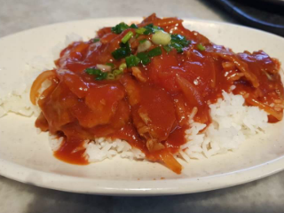  | $7.40 |

### Day 25 (08.08)

| category | food | image | price |
| :---: | :---: | :---: | :---: |
| `lunch` | Mee Goreng |  | $4.77 |
| `dinner` | Bibimbap | 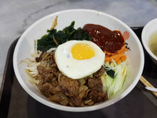 | $5.40 |

### Day 26 (08.09)

| category | food | image | price |
| :---: | :---: | :---: | :---: |
| `lunch` | Thai Cashew Chicken |  | $6.30 |
| `dinner` | Kimchi Fried Rice Set |  | $4.95 |

### Day 27 (08.10)

| category | food | image | price |
| :---: | :---: | :---: | :---: |
| `lunch` | Chicken Cutlet |  | $6.50 |
| `dinner` | Thai Fried Rice Chicken w/ Rice |  | $5.31 |

### Day 28 (08.11)

| category | food | image | price |
| :---: | :---: | :---: | :---: |
| `lunch` | 짜파게티, 햇반 |  | - |
| `dinner` | Grilled Pork Chop |  | $8.00 |

### Day 29 (08.12)

| category | food | image | price |
| :---: | :---: | :---: | :---: |
| `breakfast` | Paris Bagutte Morning Set |  | $6.50 |
| `dinner` | Chickent Cutlet Noodles, Mojo Crunch 1 PC, Waffle Double Filling |   | $7.83 |

### Day 30 (08.13)

| category | food | image | price |
| :---: | :---: | :---: | :---: |
| `lunch` | Dolsot Beef Bibimbap, Ttuk Bokgi |   | $13.50 |
| `dinner` | Mee Goreng, Beef PR |   | $17.70 |

### Day 31 (08.14)

| category | food | image | price |
| :---: | :---: | :---: | :---: |
| `lunch` | Braised Pork Sambal Fried Rice |  | $7.20 |
| `dinner` | Trio Pepper Rice with egg and cheese |  | $11.30 |

### Day 32 (08.15)

| category | food | image | price |
| :---: | :---: | :---: | :---: |
| `lunch` | Zha Jiang Ramen, Rice |  | $5.50 |
| `dinner` | Pizza, Salad |  | Provided by **Techstars** |

### Day 33 (08.16)

| category | food | image | price |
| :---: | :---: | :---: | :---: |
| `lunch` | Sundubu Chigae |  | $8.50 |
| `dinner` | Rendang Chicken Nasi |  | $6.50 |

### Day 34 (08.17)

| category | food | image | price |
| :---: | :---: | :---: | :---: |
| `lunch` | Buffalo Chicken FlatBread set |  | $6.70 |
| `dinner` | Stir-fried Dou Miao with Garlic, Oriental Wontons with Black Vinegar & Chilli Oil, Noodle with Spicy Sauce, Steamed Vegetable & Pork Dumplings, Steamed Chilli Crab and Pork Buns, Steamed Pork Dumplings, Steamed Angled Gourd & Shrimp Dumplings, Hot & Sour Soup, Mango Pudding |       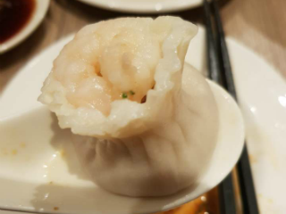   | Provided by **Rooit** |

### Day 35 (08.18)

| category | food | image | price |
| :---: | :---: | :---: | :---: |
| `lunch` | 진라면 매운맛, 햇반, 깻잎, 아몬드 멸치 조림 |  | - |
| `dinner` | 햇반, 깻잎, 아몬드 멸치 조림, 스팸, 계란후라이, 김치 |  | - |

### Day 36 (08.19)

| category | food | image | price |
| :---: | :---: | :---: | :---: |
| `breakfast` | 짜파게티 |  | - |
| `lunch` | 수제 토스트(계란, 치즈, 딸기잼, 카야잼) |  | - |
| `dinner` | 떡볶이, 군만두 |  | - |

### Day 37 (08.20)

| category | food | image | price |
| :---: | :---: | :---: | :---: |
| `lunch` | Salad, Fish |  | Provided by **Techstars** |
| `dinner` | Cheese Curry Rice w Double Beef |  | $12.80 |

### Day 38 (08.21)

| category | food | image | price |
| :---: | :---: | :---: | :---: |
| `lunch` | Kimchi soup set |  | $12.73 |
| `dinner` | Signature Scramble Egggg With Beef Rice, Seasonal Vegetable With Oyster Sauce |  | $6.75 |

### Day 39 (08.22)

| category | food | image | price |
| :---: | :---: | :---: | :---: |
| `lunch` | Arrabita Pasta |  | $6.21 |
| `dinner` | 핵불닭볶음면, prem_mixed fruit |  | $5.90 |

### Day 40 (08.23)

| category | food | image | price |
| :---: | :---: | :---: | :---: |
| `lunch` | Double Hamburg (teri), egg, french bean |  | $11.60 |

### Day 41 (08.24)

| category | food | image | price |
| :---: | :---: | :---: | :---: |
| `lunch` | Rst Chicken FlatBd, Fresh Value Meal(2 Cookies, 22oz Fountain Drink) |  | $10.20 |
| `dinner` | Lebanese foods  |       | Provided by **Groovy Antoid** |

### Day 42 (08.25)

| category | food | image | price |
| :---: | :---: | :---: | :---: |
| `lunch` | Ten Zaru Soba, Salads |   | $25.90 |
| `dinner` | Seafood Sukiyaki Glass Noodle |  | $12.36 |

### Day 43 (08.26)

| category | food | image | price |
| :---: | :---: | :---: | :---: |
| `lunch` | Sushi set |  | $9.80 |
| `dinner` | 떡볶이, 군만두, 소시지, 햇반, 와사비 김 |  | - |

### Day 44 (08.27)

| category | food | image | price |
| :---: | :---: | :---: | :---: |
| `lunch` | Heatwave, BeetrootSalad, Fried Chicken |  | $12.90 |

### Day 45 (08.28)

| category | food | image | price |
| :---: | :---: | :---: | :---: |
| `lunch` | Cheese Curry Rice w Double Beef | 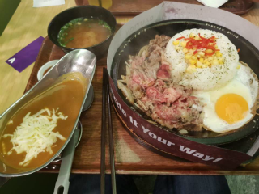 | $12.80 |

### Day 46 (08.29)

| category | food | image | price |
| :---: | :---: | :---: | :---: |
| `lunch` | Char Broiled Chicken Mushroom, Onion Rings, Mash Potatoes |  | $11.30 |

### Day 47 (08.30)

| category | food | image | price |
| :---: | :---: | :---: | :---: |
| `lunch` | Kimchi soup set |  | $12.73 |

### Day 48 (08.31)

| category | food | image | price |
| :---: | :---: | :---: | :---: |
| `lunch` | Beef Dosirak, add mushroom, onsen egg, drink & Soup combo |  | $15.90 |
| `dinner` | Vietnamese foods |   | Provided by **Google** |

### Day 49 (09.01)

| category | food | image | price |
| :---: | :---: | :---: | :---: |
| `lunch` | 군만두, 햄, 프라이에그, 김치, 햇반 |  | - |
| `dinner` | 짜파게티 |  | - |

### Day 50 (09.02)

| category | food | image | price |
| :---: | :---: | :---: | :---: |
| `lunch` | Signature Dried Chilli Noodle | 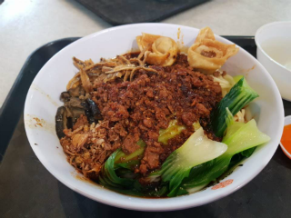 | $6.30 |

### Day 51 (09.03)

| category | food | image | price |
| :---: | :---: | :---: | :---: |
| `lunch` | Sushi set |  | $10.90 |
| `dinner` | Pepper Steak |  | $12.80 |

### Day 52 (09.04)

| category | food | image | price |
| :---: | :---: | :---: | :---: |
| `lunch` | Karashi Ramen, Gyoza |  | $17.60 |
| `dinner` | Char Broiled Chicken Mushroom saurce, Onion Rings, Green Salad |  | $8.90 |

### Day 53 (09.05)

| category | food | image | price |
| :---: | :---: | :---: | :---: |
| `lunch` | Curry Cheese Beef, Add Beef x Beef |  | $14.20 |
| `dinner` | Gyoza Set |  | $10.00 |

### Day 54 (09.06)

| category | food | image | price |
| :---: | :---: | :---: | :---: |
| `lunch` | Mesquite Fried Chicken, Green Salad, Onion Rings |  | $8.90 |
| `dinner` | Chicken & Mushroom Cream Bun, Luncheon Meat & Egg Bun, YOU-C1000 Orange |  | $5.30 |

### Day 55 (09.07)

| category | food | image | price |
| :---: | :---: | :---: | :---: |
| `lunch` | Ra Myeon Beef, Rice |  | $8.50 |
| `dinner` | Chicken Combo |  | $9.50 |

### Day 56 (09.08)

| category | food | image | price |
| :---: | :---: | :---: | :---: |
| `lunch` | Massaman Chicken Curry |  | $17.06 |
| `dinner` | 짜파게티 x 볼케이노 치킨 볶음면 x 계란 후라이 |  | - |

### Day 57 (09.09)

| category | food | image | price |
| :---: | :---: | :---: | :---: |
| `lunch` | Roasted Chicken Rice |  | $5.00 |
| `dinner` | Soya Sauce Chicken Rice, Seasonal Vegetables |  | $8.80 |

### Day 58 (09.10)

| category | food | image | price |
| :---: | :---: | :---: | :---: |
| `lunch` | Steak Bites & Hamburg, Add Egg, Cheese |  | $13.50 |
| `dinner` | Katsu Curry |  | $12.00 |

### Day 59 (09.11)

| category | food | image | price |
| :---: | :---: | :---: | :---: |
| `lunch` | Roasted Chicken Rice W Vegetables & Soup |  | $7.50 |
| `dinner` | Grilled Sausage Platter, Onion Rings, Green Salad | 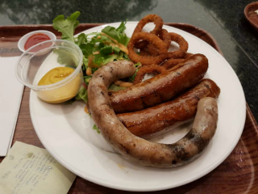 | $14.90 |

### Day 60 (09.12)

| category | food | image | price |
| :---: | :---: | :---: | :---: |
| `lunch` | Sushi Udon Set |  | $15.00 |
| `dinner` | Ramen Tendon Set |  | $14.00 |

### Day 61 (09.13)

| category | food | image | price |
| :---: | :---: | :---: | :---: |
| `lunch` | Mini Red Velvet Cake, Assorted Sushi Platter, Potato Croquette, Sweet and Sour Beancurd, Seasonal Vegetables, Nyonya Stir-Fried Prawns, Blackened Snapper, Aromatic Rempah Chicken, Multi-Grain Basil Rice, Marble Potato Salad | 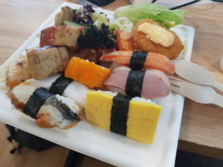 | Provided by **Techstars** |
| `dinner` | Char Broiled Chicken Mushroom, Double Green Salad |  | $8.90 |

### Day 62 (09.14)

| category | food | image | price |
| :---: | :---: | :---: | :---: |
| `lunch` | Ra Myeon Beef, Rice, Fruits |   | $12.50 |
| `dinner` | Italian Foods |   | Provided by **AND Global** |

### Day 63 (09.15)

| category | food | image | price |
| :---: | :---: | :---: | :---: |
| `lunch` | Donkatsu, Salads |    | Provided by **Nirlo** |
| `dinner` | Seafood Pineapple Fried Rice, Red Ruby with Coconut Icecream |   | $18.25 |

### Day 64 (09.16)

| category | food | image | price |
| :---: | :---: | :---: | :---: |
| `lunch` | Breakfast Deluxe ML, Medium Coke Zero |  | $8.90 |
| `dinner` | Phad Thai, Thai Fried Rice Chicken |  | $10.26 |

### Day 65 (09.17)

| category | food | image | price |
| :---: | :---: | :---: | :---: |
| `lunch` | Donkatsu, Salads | 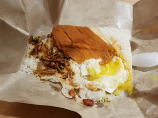 | Provided by **Wework** |
| `dinner` | Steak Bites (150g), Add Chicken |  | $15.50 |

### Day 66 (09.18)

| category | food | image | price |
| :---: | :---: | :---: | :---: |
| `lunch` | Garlic Pork Chops, Green Salad, Onion Rings | 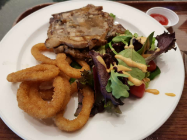 | $11.90 |
| `dinner` | Ra Myeon Beef, Rice |  | $8.50 |

### Day 67 (09.19)

| category | food | image | price |
| :---: | :---: | :---: | :---: |
| `lunch` | Kimchi soup set |  | $12.73 |
| `dinner` | Kaisendon |  | $16.00 |
| `midnight` | 짜파게티, 치즈 추가 |  | - |

### Day 68 (09.20)

| category | food | image | price |
| :---: | :---: | :---: | :---: |
| `lunch` | Cheese Curry Rice Beef, Add Double Beef |  | $14.20 |
| `dinner` | Pork Chop Fried Rice |  | $7.20 |

### Day 69 (09.21)

| category | food | image | price |
| :---: | :---: | :---: | :---: |
| `lunch` | Dolsot Beef |  | $8.50 |
| `dinner` | American Foods |      | Provided by **Immersive** |

### Day 70 (09.22)

| category | food | image | price |
| :---: | :---: | :---: | :---: |
| `lunch` | 햇반, 아몬드 멸치 조림, 햄, 계란후라이, 군만두 | 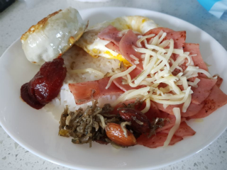 | - |
| `dinner` | Chilli Crab set |    | $65.00 |

### Day 71 (09.23)

| category | food | image | price |
| :---: | :---: | :---: | :---: |
| `lunch` | Signature Scramble Egg With Beef Rice, Pad Thai Chicken, Thai Honey Chicken, Mango Ice Kacang |     | $19.26 |
| `dinner` | Chinese foods |  | $135.90 |

### Day 72 (09.24)

| category | food | image | price |
| :---: | :---: | :---: | :---: |
| `lunch` | Bibimbab Beef, Ttuk Bokgi |  | $13.00 |
| `dinner` | Char Broiled Chicken Mushroom, Double Green Salad |  | $8.90 |

### Day 73 (09.25)

| category | food | image | price |
| :---: | :---: | :---: | :---: |
| `lunch` | Kimchi Soup |  | $12.70 |
| `dinner` | Ramen Curry Set, Boiled Gyoza |  | $15.00 |

### Day 74 (09.26)

| category | food | image | price |
| :---: | :---: | :---: | :---: |
| `lunch` | Double Wolf Burger |  | Provided by **Techstars** |
| `dinner` | Regular Bowl Spicy Garlic Sesame Tuna with Sushi Rice |  | Provided by **Techstars** |

### Day 75 (09.27)

| category | food | image | price |
| :---: | :---: | :---: | :---: |
| `lunch` | Jja jang myun |  | $16.50 |
| `dinner` | Thai Basil Chicken with Rice set |  | $15.20 |

### Day 76 (09.28)

| category | food | image | price |
| :---: | :---: | :---: | :---: |
| `lunch` | Jja jang myun, Jjam Bbong, Tang Su Yuk, Gun Man Du  |  | $71.50 |
| `dinner` | Cheese Bacon & Egg Bun, Pizza Mushroom & Sausage, Meiji Chocolate Milk |  | $5.20 |

### Day 77 (09.29)

| category | food | image | price |
| :---: | :---: | :---: | :---: |
| `lunch` | 삼계탕 & 햇반 |  | - |
| `dinner` | 볼케이노 치킨 볶음면 & 치즈 |  | - |

### Day 78 (09.30)

| category | food | image | price |
| :---: | :---: | :---: | :---: |
| `lunch` | Tori Karaage6pcs, Salads |    | $16.50 |
| `dinner` | Pepper Beef Friend Rice |  | $5.85 |

### Day 79 (10.01)

| category | food | image | price |
| :---: | :---: | :---: | :---: |
| `lunch` | Cheese Curry Rice w Double Beef, Add Beansprout |  | $11.90 |
| `dinner` | Spicy Sesame Keisendon |  | $16.80 |

### Day 80 (10.02)

| category | food | image | price |
| :---: | :---: | :---: | :---: |
| `lunch` | Bulgogi Beef |  | $8.80 |
| `dinner` | Double Beef Pepper Rice, Add Cheese, Add Eggg |  | $12.20 |
| `midnight` | 짜파게티, 치즈 추가 |  | - |

### Day 81 (10.03)

| category | food | image | price |
| :---: | :---: | :---: | :---: |
| `lunch` | Salmon Mentaiko Brown Rice |  | Provided by **Techstars** |
| `dinner` | Bibimbab Beef |  | $8.00 |

### Day 82 (10.04)

| category | food | image | price |
| :---: | :---: | :---: | :---: |
| `lunch` | Kimchi soup set |  | $12.73 |
| `dinner` | Cheese Curry Rice w Double Beef, Add Beansprout |  | $11.90 |

### Day 83 (10.05)

| category | food | image | price |
| :---: | :---: | :---: | :---: |
| `lunch` | Zenbu Kara |  | $22.37 |
| `dinner` | Grilled Sausage Platter, Onion Rings, Green Salad |  | $14.90 |

### Day 84 (10.06)

| category | food | image | price |
| :---: | :---: | :---: | :---: |
| `breakfast` | Egg & Cheese Sandwich |  | $2.90 |
| `lunch` | Porktober Fest! |  | $69.70 |

### Day 85 (10.07)

| category | food | image | price |
| :---: | :---: | :---: | :---: |
| `lunch` | Donkatsu, Salads |    | $18.85 |
| `dinner` | Pad Thai Chicken |  | $4.95 |
| `midnight` | 짜파게티, 치즈 추가 |  | - |

### Day 86 (10.08)

| category | food | image | price |
| :---: | :---: | :---: | :---: |
| `lunch` | Arrabiata Pasta |  | $6.21 |
| `dinner` | Double Beef Pepper Rice, Add Beansprout |  | $10.80 |

### Day 87 (10.09)

| category | food | image | price |
| :---: | :---: | :---: | :---: |
| `lunch` | Pineapple Rice |  | $4.95 |
| `dinner` | Chicken Cutlet, Fried Fish Set |  | $5.85 |

### Day 88 (10.10)

| category | food | image | price |
| :---: | :---: | :---: | :---: |
| `breakfast` | Poached Egg & Turkey Ham, Americano | 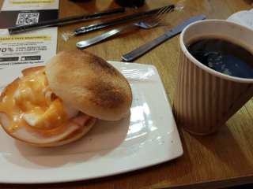 | $7.20 |
| `lunch` | Hamburger, Potato Fries |  | Provided by **Techstars** |
| `midnight` | 비빔면 | 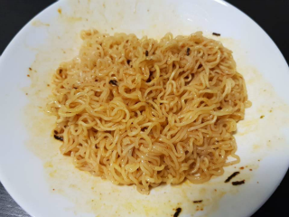 | - |

### Day 89 (10.11)

| category | food | image | price |
| :---: | :---: | :---: | :---: |
| `lunch` | Teriyaki Chicken Omelette Rice, Honey Pineapple Juice |  | $7.80 |
| `dinner` | Pizzas, Sausages, Chicken wings |  | Provided by **Techstars** |
| `midnight` | 짜파게티 |  | - |

### Day 90 (10.12)

| category | food | image | price |
| :---: | :---: | :---: | :---: |
| `lunch` | Pork Ribs Soup, Braised Pig's Trotters, Braised Pork Belly, Cai Xin, Dough Fritters |  | $37.19 |
| `dinner` | Buffet |        | $52.97 |

### Day 91 (10.13)

| category | food | image | price |
| :---: | :---: | :---: | :---: |
| `lunch` | Buta Kimuchi Itame, Salads |    | $20.00 |
| `dinner` | Candied Bacon, Bacon Wrapped Meatballs, Sauteed Mushrooms, Pop Corn Pork, Morgan's Rib Sampl3R |      | Provided by **Additor** |
