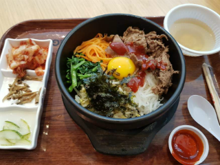
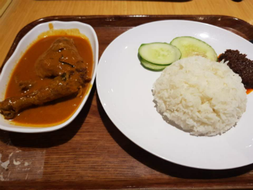

# Today I Ate (07.15 ~ )

## This repository is a report of What I Ate in Singapore.

### Day 01 (07.15)

| category | food | image | price |
| :---: | :---: | :---: | :---: |
| `lunch` | Char Siew Noodle |  | $3.00 |
| `dinner` | 진라면 매운맛 + 계란, 김치만두 |  | - |

### Day 02 (07.16)

| category | food | image | price |
| :---: | :---: | :---: | :---: |
| `lunch` | Grilled Pork Sandwich, Salad |  | Provided by **Techstars** |
| `dinner` | Cereal Chicken Chop Rice |  | $6.30 |

### Day 03 (07.17)

| category | food | image | price |
| :---: | :---: | :---: | :---: |
| `lunch` | HK Style Beaf Fried Rice |  | $6.00 |
| `dinner` | Jumbo Seafood Set |        | Provided by **Nique**'s Friend |

### Day 04 (07.18)

| category | food | image | price |
| :---: | :---: | :---: | :---: |
| `lunch` | Fried Spring Roll & Pork |  | $6.00 |
| `dinner` | Lau Pa Sat Foods |  | Provided by **Techstars** |

### Day 05 (07.19)

| category | food | image | price |
| :---: | :---: | :---: | :---: |
| `lunch` | Dumpling Noodles |  | $4.50 |
| `dinner` | Chickent Chop Hor Fun, Lemon Juice |  | $8.10 |

### Day 06 (07.20)

| category | food | image | price |
| :---: | :---: | :---: | :---: |
| `lunch` | Saba Fish w Organic |  | $5.40 |
| `dinner` | Arrabita Pasta |  | $6.21 |

### Day 07 (07.21)

| category | food | image | price |
| :---: | :---: | :---: | :---: |
| `dinner` |  Thai Laksa With Chicken |  | $15.88 |

### Day 08 (07.22)

| category | food | image | price |
| :---: | :---: | :---: | :---: |
| `lunch` | GlutinousRice w Chk/FanChoy per plate, Steamed Beancurd Roll, Steamed Prawn Dumpling |  | $8.19 |
| `dinner` | HK Kai Lan Beef Fried Rice + Seasonal Vegetable With Oyster Sauce |  | $6.30 |

### Day 09 (07.23)

| category | food | image | price |
| :---: | :---: | :---: | :---: |
| `lunch` | Halal foods |  | Provided by **Techstars** |
| `dinner` | Thai Basil Chicken |  | $4.95 |
| `midnight` | KFC |  | Provided by **Nirlo** |

### Day 10 (07.24)

| category | food | image | price |
| :---: | :---: | :---: | :---: |
| `lunch` | Laksa, Honey Lemon Juice |  | $6.30 |
| `dinner` | Veg meal |  | $6.75 |

### Day 11 (07.25)

| category | food | image | price |
| :---: | :---: | :---: | :---: |
| `lunch` | Thai Fried Rice Wrapped Egg W Fried Fish |  | $5.85 |
| `dinner` | Fusion Delight |  | $7.20 |

### Day 12 (07.26)

| category | food | image | price |
| :---: | :---: | :---: | :---: |
| `lunch` | Seafood Marinara |  | $6.21 |
| `dinner` | Boneless Mutton Briyani |  | $6.30 |

### Day 13 (07.27)

| category | food | image | price |
| :---: | :---: | :---: | :---: |
| `lunch` | Ayam Penyet Set |  | $5.85 |
| `dinner` | Indian foods |  | Provided by **Shoffr** |

### Day 14 (07.28)

| category | food | image | price |
| :---: | :---: | :---: | :---: |
| `lunch` | Buttermilk Chicken Set |  | $9.85 |
| `dinner` | Meal Packages |  | $8.00 |

### Day 15 (07.29)

| category | food | image | price |
| :---: | :---: | :---: | :---: |
| `lunch` | Pork Cutlet Curry Udon |  | $4.50 |
| `dinner` | HK Style Pork Chop Rice + 50 Mins Slow Cook Onsen Egg |  | $6.37 |

### Day 16 (07.30)

| category | food | image | price |
| :---: | :---: | :---: | :---: |
| `lunch` | PORK chop Rice Plus Change to FRIES |  | $13.80 |
| `dinner` | Belachan Fried Rice W Egg & Chicken Drumstick |  | $5.31 |

### Day 17 (07.31)

| category | food | image | price |
| :---: | :---: | :---: | :---: |
| `lunch` | Soy Sesame Chicken w/ White Rice, Spice Delight |   | Provided by **Techstars** |
| `dinner` | Ayam Bakar |  | $5.85 |

### Day 18 (08.01)

| category | food | image | price |
| :---: | :---: | :---: | :---: |
| `lunch` | Kimchi chigae |  | $16.15 |
| `dinner` | Nasi Goreng |  | $6.00 |

### Day 19 (08.02)

| category | food | image | price |
| :---: | :---: | :---: | :---: |
| `lunch` | Kimchi Spicy & Sour Chicken Cutlet / Dumpling Noodle |  | $4.32 |
| `dinner` | Chicken Curry Rice, YaKun Coffee, Yakun Biscuit |   | $7.50 |

### Day 20 (08.03)

| category | food | image | price |
| :---: | :---: | :---: | :---: |
| `lunch` | Super Value Meal |  | $16.80 |
| `dinner` | Korean foods |  | Provide by **Additor** |

### Day 21 (08.04)

| category | food | image | price |
| :---: | :---: | :---: | :---: |
| `lunch` | Signature Boiled Chicken, Sweet & Sour Pork |  | $13.00 |
| `dinner` | Signature Kanshoku Ramen, Pork Gyoza |  | $16.50 |

### Day 22 (08.05)

| category | food | image | price |
| :---: | :---: | :---: | :---: |
| `lunch` | Meatball Flatbread, 16oz Fountain Drink |  | $9.20 |
| `dinner` | Americano, Carbonara, Lasagna, Margherita Parma, Risotto Fungi |     | $127.53 |

### Day 23 (08.06)

| category | food | image | price |
| :---: | :---: | :---: | :---: |
| `lunch` | Yong Tau Foo |  | $9.45 |
| `dinner` | ChulPanDagGalbi, Gamjatang, Rice, Sari, bakuembap |   | $140.07 |

### Day 24 (08.07)

| category | food | image | price |
| :---: | :---: | :---: | :---: |
| `lunch` | Rendang Angus Meal |  | $8.95 |
| `dinner` | Homemade Tomato Sauce Beef, Pan-Fried Mixed Seafood & Pork Dumpling |   | $7.40 |

### Day 25 (08.08)

| category | food | image | price |
| :---: | :---: | :---: | :---: |
| `lunch` | Mee Goreng |  | $4.77 |
| `dinner` | Bibimbap |  | $5.40 |

### Day 26 (08.09)

| category | food | image | price |
| :---: | :---: | :---: | :---: |
| `lunch` | Thai Cashew Chicken |  | $6.30 |
| `dinner` | Kimchi Fried Rice Set |  | $4.95 |

### Day 27 (08.10)

| category | food | image | price |
| :---: | :---: | :---: | :---: |
| `lunch` | Chicken Cutlet |  | $6.50 |
| `dinner` | Thai Fried Rice Chicken w/ Rice |  | $5.31 |

### Day 28 (08.11)

| category | food | image | price |
| :---: | :---: | :---: | :---: |
| `lunch` | 짜파게티, 햇반 |  | - |
| `dinner` | Grilled Pork Chop |  | $8.00 |

### Day 29 (08.12)

| category | food | image | price |
| :---: | :---: | :---: | :---: |
| `breakfast` | Paris Bagutte Morning Set |  | $6.50 |
| `dinner` | Chickent Cutlet Noodles, Mojo Crunch 1 PC, Waffle Double Filling |   | $7.83 |

### Day 30 (08.13)

| category | food | image | price |
| :---: | :---: | :---: | :---: |
| `lunch` | Dolsot Beef Bibimbap, Ttuk Bokgi |   | $13.50 |
| `dinner` | Mee Goreng, Beef PR |   | $17.70 |

### Day 31 (08.14)

| category | food | image | price |
| :---: | :---: | :---: | :---: |
| `lunch` | Braised Pork Sambal Fried Rice |  | $7.20 |
| `dinner` | Trio Pepper Rice with egg and cheese |  | $11.30 |

### Day 32 (08.15)

| category | food | image | price |
| :---: | :---: | :---: | :---: |
| `lunch` | Zha Jiang Ramen, Rice |  | $5.50 |
| `dinner` | Pizza, Salad |  | Provided by **Techstars** |

### Day 33 (08.16)

| category | food | image | price |
| :---: | :---: | :---: | :---: |
| `lunch` | Sundubu Chigae |  | $8.50 |
| `dinner` | Rendang Chicken Nasi |  | $6.50 |

### Day 34 (08.17)

| category | food | image | price |
| :---: | :---: | :---: | :---: |
| `lunch` | Buffalo Chicken FlatBread set |  | $6.70 |
| `dinner` | Stir-fried Dou Miao with Garlic, Oriental Wontons with Black Vinegar & Chilli Oil, Noodle with Spicy Sauce, Steamed Vegetable & Pork Dumplings, Steamed Chilli Crab and Pork Buns, Steamed Pork Dumplings, Steamed Angled Gourd & Shrimp Dumplings, Hot & Sour Soup, Mango Pudding |          | Provided by **Rooit** |

### Day 35 (08.18)

| category | food | image | price |
| :---: | :---: | :---: | :---: |
| `lunch` | 진라면 매운맛, 햇반, 깻잎, 아몬드 멸치 조림 |  | - |
| `dinner` | 햇반, 깻잎, 아몬드 멸치 조림, 스팸, 계란후라이, 김치 |  | - |

### Day 36 (08.19)

| category | food | image | price |
| :---: | :---: | :---: | :---: |
| `breakfast` | 짜파게티 |  | - |
| `lunch` | 수제 토스트(계란, 치즈, 딸기잼, 카야잼) |  | - |
| `dinner` | 떡볶이, 군만두 |  | - |